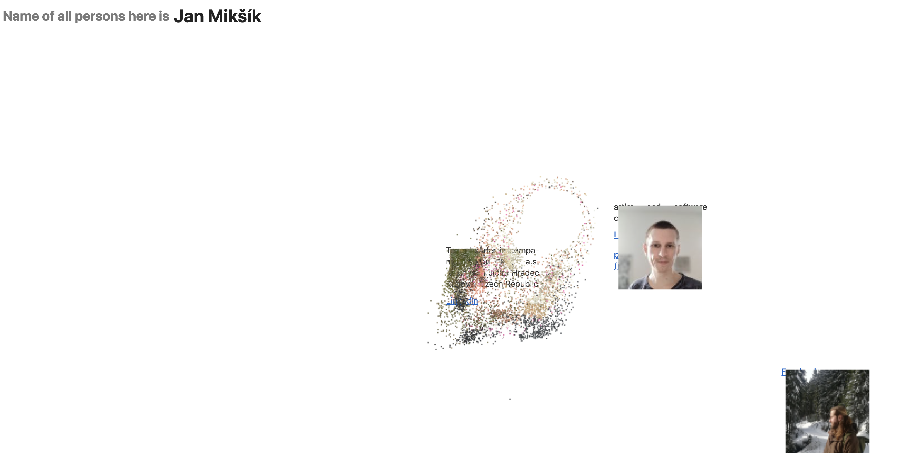

# janmiksik.com

**web art project, collecting people who have the same name as me.**

This is an interactive website that serves as a crossroads from which you can visit a specific Jan Miksik profile. No other person with the same full name as me had registered this domain before, so I decided to share it in my own way.
The list of people with the same name is not complete; that wasn’t the goal. However, I offer the option to email me if someone with the same full name wants to be added, edited, or removed from the website. The profiles are loaded in a random position each time to equalise positional advantages and disadvantages.

## Preview

## Inspiration

This project was inspired by the interactive particle effect technique demonstrated in this video: [Interactive Particle Effect Tutorial](https://youtu.be/vAJEHf92tV0?si=clGZUQZ3xsbpuP3g)

## Tech Stack

- [Nuxt 3](https://nuxt.com/) - Vue.js meta-framework for building modern web applications
- [Vue 3](https://vuejs.org/) - Progressive JavaScript framework
- Native HTML5 Canvas for interactive particle effects
